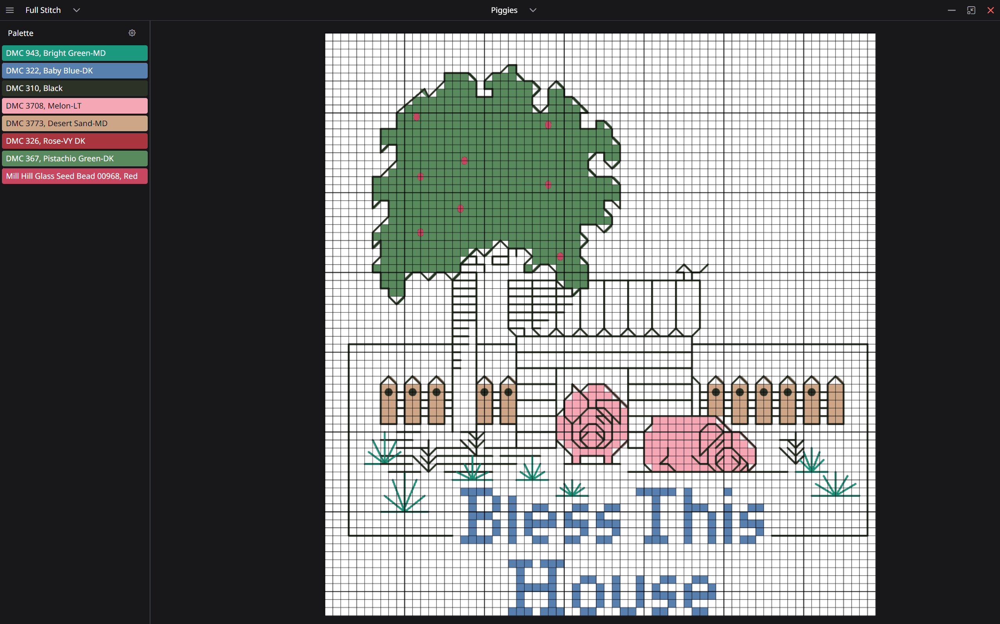

# Embroidery Studio

A free, open-source, cross-platform desktop application for designing cross-stitch patterns.

> [!IMPORTANT]
> Embroidery Studio is currently in the active development stage.
> It does not have a stable release.
> The flow may change significantly in each version.
> We do not recommend using Embroidery Studio in production for now.
> However, we would appreciate your feedback if you could try it and let us know.
> It is essential for us.

If you have any questions, don't hesitate to contact the author via [email](mailto:nazarantoniuk18@gmail.com).
You can also join the [Telegram chat](https://t.me/embroidery_space), where we will likely build our community.

Screenshots

Motivation

## Backstory

[Pattern Maker for Cross Stitch](https://web.archive.org/web/20191127080612/http://www.hobbyware.com:80) dominated the embroidery software industry for about 30 years.
It was a great software that provided users with many features to create embroidery patterns. 😍

Over the past decade, this product hasn't developed much, moving more to the maintenance stage instead.
And then on 31 December 2019, the company closed down, finally [ending support for](https://web.archive.org/web/20191216014549/http://www.hobbyware.com:80) and further development of PM, and completely disappeared from the horizon, there is no longer any contact with them.

At the moment, the only existing edition (at least the only one known to the author) is the russian 🤮 cracked and patched version.
If you care about your information security, we strongly recommend that you don't even try to find this version, let alone download and install it on your computer.

It's worth noting that quite a few applications (both desktop and mobile) from other developers are also on the market.
However, most of them have remained at the level of PM usability (and sometimes even took a step back).
They're constrained in terms of functionality: in general, they are just for viewing existing patterns without the ability to edit and create new ones.

Considering these circumstances and the author's love for the art of embroidery, it was decided to start developing a fundamentally new application: Embroidery Studio.
We plan to improve this kind of software's already established basic functionality and implement an ideologically new one.

## Vision

We have a lot of ideas on how to improve the current state of things.
Check out our [vision](./VISION.md).

## Install

Information on how to install Embroidery Studio can be found in the [installation guide](./INSTALLATION.md).

## Contributing

We are open to any contribution to this project.
Please check out our [contribution guide](./CONTRIBUTING.md).

## License

Embroidery Studio is licensed under the GPL-3.0-or-later.
